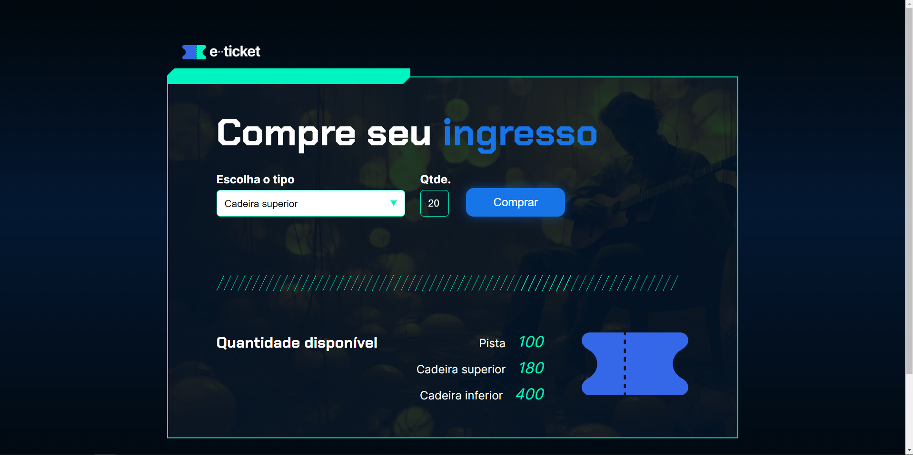

## Visão Geral

### O projeto

- Fazer um site que as pessoas possam selecionar a quantidade e quais ingressos elas querem pegar, descontando do total após a compra

### Screenshot

### Links

- Live Site URL: [Ingresso](https://ingresso-one.vercel.app/)

## Meu processo

### Criado com

- JavaScript
- HTML e CSS fornecidos pelo curso

### O que eu aprendi

- Mais sobre lógica de programação

## Autor

- GitHub - [João Metzdorf](https://github.com/joaometzdorf)
